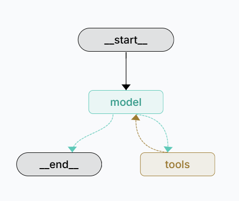

# Langchain-dev-utils Example Project

This repository provides an example project demonstrating how to efficiently build two typical agent systems using the utility functions provided by `langchain-dev-utils`:

- **Single Agent**: Suitable for executing simple tasks and tasks related to long-term memory storage.
- **Supervisor-Multi-Agent Architecture**: Coordinates multiple specialized agents through a central supervisor, applicable to complex scenarios requiring task decomposition, planning, and iterative optimization.

<p align="center">
  
</p>

## Quickstart

1. Clone this repository:
```bash
git clone https://github.com/TBice123123/langchain-dev-utils-example.git  
cd langchain-dev-utils-example
```

2. Install dependencies using uv:
```bash
uv sync
```

3. Create .env file:
```bash
cp .env.example .env
```

4. Edit the `.env` file and enter your API keys (API keys for `OpenRouter` and `Tavily` are required)

5. Start the project:
```bash
langgraph dev
```

## Contributing Guidelines

This project is open source under the MIT license. Community contributions are welcome! You can submit Pull Requests or create Issues to discuss improvement suggestions or ideas.